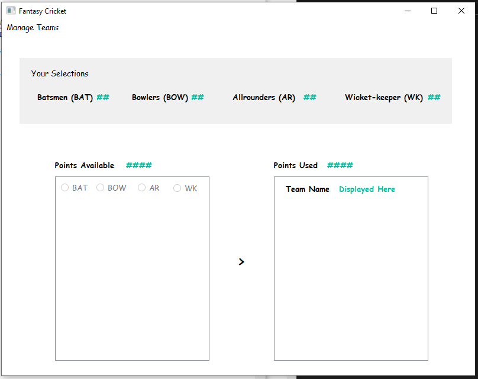
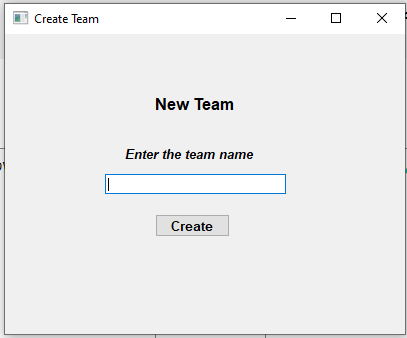
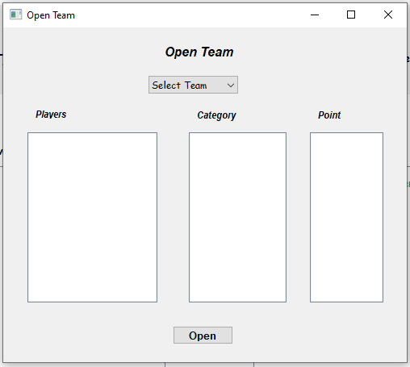
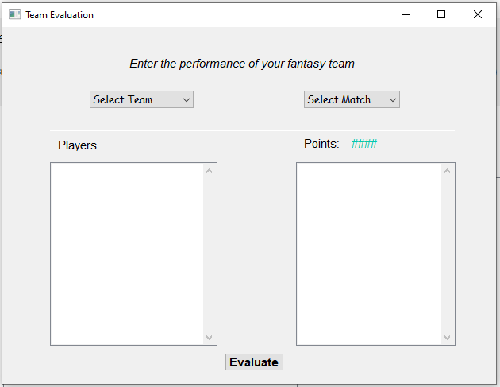

# Fantasy-Cricket-Game-Python
fantasy cricket game is a Python GUI based application where a user creates his own team and get his team score calculated.

All .ui files are created using Qt designer from pyqt5 toolkit.
These .ui files are conerted into .py files and some definitions are added to calculate score of a team.
players_DB is a database file created using Sqlitestudio.

Run the Fantasy_cricket.py file.

You can click on Manage teams to get a dropdown box where you can select to create a new team and save the team to database after selecting players.

you can check your team after saving by clicking open team in dropdown menu.

Next you can calculate your team score by clicking on evaluate team in dropdown menu.

Total points of team created by user can be seen after clicking evaluate button.   
